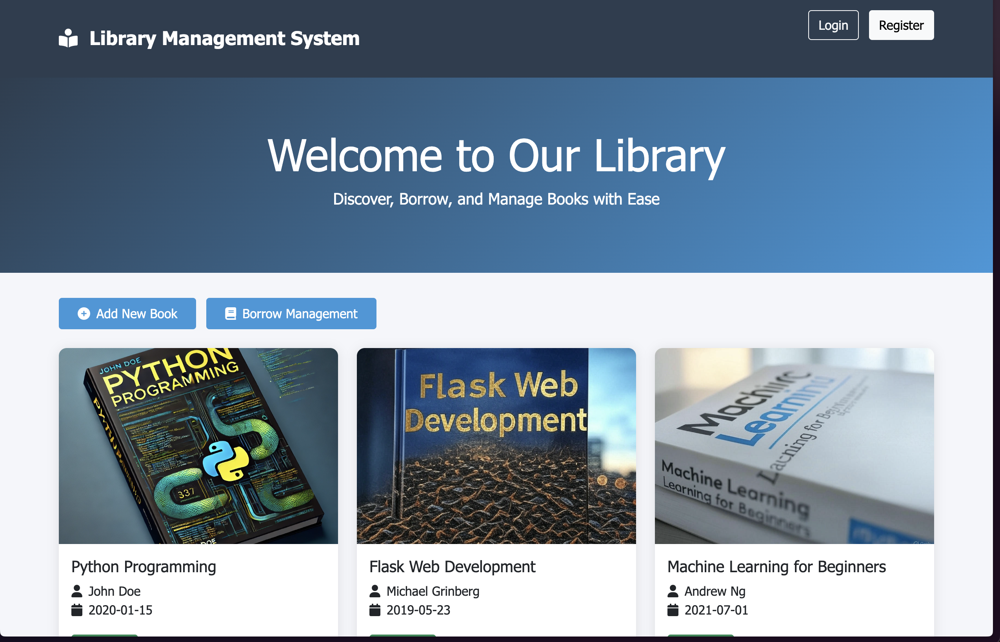
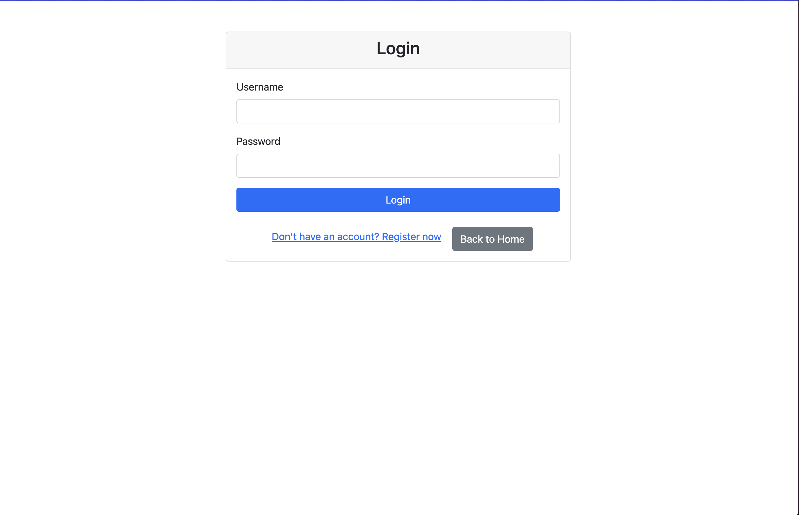
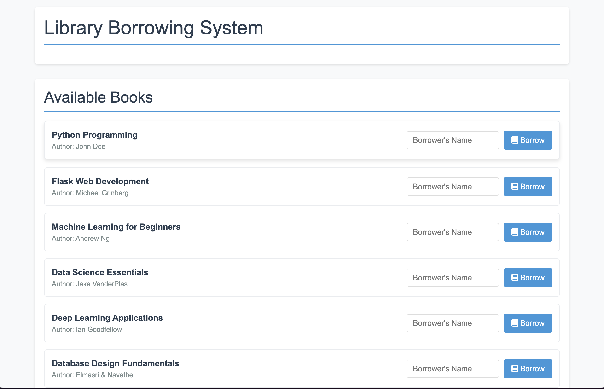

# Library Management System

A Flask-based library management system with user authentication and book borrowing functionality.





## Features

- User Authentication (Login/Register)
- JWT-based Authorization
- Book Management (Add/Edit/Delete)
- Book Borrowing System
- Account Security Features
  - Failed Login Attempt Tracking
  - Account Lockout Protection
  - Secure Password Hashing

## Tech Stack

- **Backend**: Python Flask
- **Database**: MySQL
- **Authentication**: JWT + Flask-Login
- **Frontend**: Bootstrap 5
- **Security**: Bcrypt
- **Container**: Docker/Kubernetes ready

## Project Structure
```
project_root/
├── screenshots/
│   ├── login.png
│   ├── books.png
│   └── borrow.png
├── app.py # Main application file ├── templates/
│ ├── login.html # Login page
│ ├── register.html # Registration page 
│ ├── index.html # Home page 
│ ├── borrow.html # Borrowing system 
│ └── add_book.html # Add book form 
├── static/ 
│ └── images/ # Book cover images 
└── README.md
```

## Screenshots

### Homepage


### Login Page


### Book Management


## Setup Instructions

1. Clone the repository
```bash
git clone <repository-url>
```
2.Set up virtual environment
```python -m venv .venv
source .venv/bin/activate  # For Unix
.venv\Scripts\activate     # For Windows 
```

3.Install dependencies
```
pip install -r requirements.txt
```
4.Configure environment variables
```export DB_USER=your_db_user
export DB_PASSWORD=your_db_password
export DB_HOST=your_db_host
export DB_NAME=flask_book_app
export JWT_SECRET_KEY=your_jwt_secret
export SECRET_KEY=your_app_secret
```
5. Initialize database
``` 
   flask db upgrade
```
6.Run the application
```
python app.py
```
API Endpoints
* /register - User registration
* /login - User login
* /logout - User logout
* /borrow_system - Book borrowing management
* /add - Add new book
* /edit/<book_id> - Edit book details
* /delete/<book_id> - Delete book
* /borrow/<book_id> - Borrow a book
* /return/<book_id> - Return a book

## Database Setup

### MySQL Configuration
1. Install MySQL Server
```bash
# For Ubuntu/Debian
sudo apt-get install mysql-server

# For macOS using Homebrew
brew install mysql
```

2. Start MySQL Service
```bash
# For Ubuntu/Debian
sudo systemctl start mysql

# For macOS
brew services start mysql
```

3. Create Database and User
```sql
# Login to MySQL
mysql -u root -p

# Create database
CREATE DATABASE flask_book_app;

# Create user and grant privileges
CREATE USER 'root'@'localhost' IDENTIFIED BY 'mysql';
GRANT ALL PRIVILEGES ON flask_book_app.* TO 'root'@'localhost';
FLUSH PRIVILEGES;
```

### Default Database Settings
```python
DB_USER = 'root'
DB_PASSWORD = 'mysql'
DB_HOST = '127.0.0.1'
DB_NAME = 'flask_book_app'
```

### Initial Data
The system will automatically initialize with 20 sample books:
- 10 Chinese books (Programming, ML, AI topics)
- 10 English books (Similar topics in English)

### Database Schema
```sql
-- Books Table
CREATE TABLE book (
    id INTEGER PRIMARY KEY AUTO_INCREMENT,
    title VARCHAR(200) NOT NULL,
    author VARCHAR(100) NOT NULL,
    published_date VARCHAR(20),
    is_borrowed BOOLEAN DEFAULT FALSE,
    image_url VARCHAR(500)
);

-- Borrow Records Table
CREATE TABLE borrow_record (
    id INTEGER PRIMARY KEY AUTO_INCREMENT,
    book_id INTEGER NOT NULL,
    borrower_name VARCHAR(100) NOT NULL,
    borrow_date DATETIME DEFAULT CURRENT_TIMESTAMP,
    return_date DATETIME,
    FOREIGN KEY (book_id) REFERENCES book(id)
);

-- Users Table
CREATE TABLE user (
    id INTEGER PRIMARY KEY AUTO_INCREMENT,
    username VARCHAR(100) UNIQUE NOT NULL,
    password_hash VARCHAR(200) NOT NULL,
    login_attempts INTEGER DEFAULT 0,
    locked_until DATETIME
);
```

### Database Management
```bash
# Backup database
mysqldump -u root -p flask_book_app > backup.sql

# Restore database
mysql -u root -p flask_book_app < backup.sql

# Monitor database connections
SHOW PROCESSLIST;
```

## Security Features
* Password hashing using Bcrypt
* JWT authentication
* Account lockout after 5 failed login attempts
 15-minute lockout duration
* Secure cookie handling
* CSRF protection
# Docker Support
Build the image:
```docker build -t library-system .
```

# Contributing
1. Fork the repository
2. Create your feature branch
3. Commit your changes
4. Push to the branch
5. Create a Pull Request

# License
MIT License

# Author
Samuel-chuang


#Acknowledgments
Flask framework
Bootstrap team
MySQL team